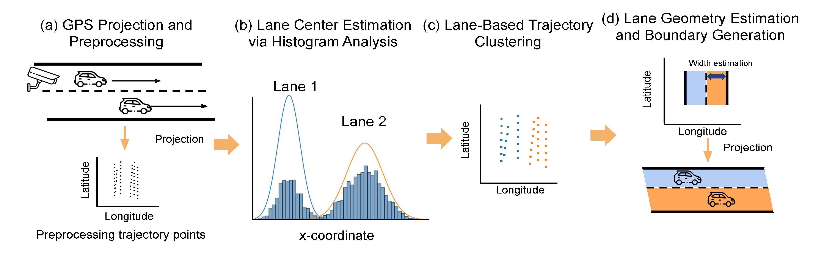
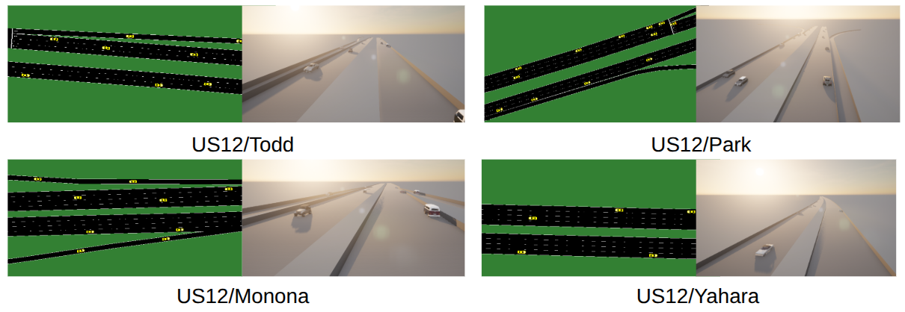

# Geo-ORBIT: A Federated Digital Twin Framework for Scene-Adaptive Lane Geometry Detection

**Authors**: Rei Tamaru, Pei Li, and Bin Ran  
**Affiliation**: University of Wisconsin–Madison

## Overview

**Geo-ORBIT** (Geometrical Operational Roadway Blueprint with Integrated Twin) is a unified framework that integrates real-time lane detection, federated learning, and digital twin synchronization. It is designed to support active traffic management, infrastructure monitoring, and real-time scenario testing without relying on centralized data collection.

At the core of Geo-ORBIT is **FedMeta-GeoLane**, a federated meta-learning-based lane detection model that adapts to scene-specific geometry using only vehicle trajectory data. By preserving privacy and reducing bandwidth, this system enables scalable deployment across diverse roadside camera environments.

## System Architecture

Geo-ORBIT is composed of three modular and interconnected processes:

- **Detection Process**  
  Roadside cameras capture traffic video, from which vehicle trajectories are extracted and projected to GPS space.

- **Service Process**  
  The **FedMeta-GeoLane** model infers lane geometries from trajectories using adaptive parameters, refined through meta-learning and weak supervision (e.g., OpenStreetMap).

- **Simulation Process**  
  Detected lanes are synchronized with **SUMO** and **CARLA** to create a high-fidelity, real-time **Digital Twin** that supports traffic flow rendering and scenario replay.

<figure style="text-align: center;">
  
  <figcaption><b>Figure:</b> Architecture of the federated meta-learning framework. The framework detects roadway geometry at local entities with local GeoLane models. The central server collects parameters from local entities with federated learning. The DT synchronizes road geometry and trajectories in a simulated environment.</figcaption>
</figure>

## FedMeta-GeoLane: Federated Meta-Learning Lane Detection

FedMeta-GeoLane treats each roadside camera deployment as a unique task. A shared meta-learner predicts optimal detection parameters using context features like vehicle speed and trajectory distribution. Key highlights include:

- **Black-box meta-learning**: No need for gradient flow through detection pipeline  
- **Federated optimization**: Local training with privacy-preserving aggregation  
- **Scene adaptation**: Immediate configuration for unseen locations

<figure style="text-align: center;">
  
  <figcaption><b>Figure:</b> Overview of Knowledge-Based Lane Detection Algorithm. (a) Video detection and trajectory projection to GPS coordinates. (b) Lane center estimation using histogram analysis. (c) Lane-based trajectory clustering with KMeans. (d) Lane geometry estimation and boundary generation.</figcaption>
</figure>

_Compared to baseline and centralized models, FedMeta-GeoLane reduces geometric error by over 50% in unseen locations while achieving a 98% reduction in communication cost._

## Performance Summary

### Lane Detection Accuracy
**Table: Validation Loss Component Comparisons of Each Model on Seen and Unseen Locations**
| **Model**            | **Consistency Loss (m) &#8595;** | **Geometry Loss (m) &#8595;** | **Centerline Error (m) &#8595;** | **Lane Count Error &#8595;** |**Total Loss &#8595;** |
|------------------|---------------------|-------------------------|--------------------|-----------------------|-----------------------|
| _Seen_             |                   |                    |                       |                  |                     |
| Baseline         | 5.45              | 15.12              | 6.78                  | 5.00             | 77.84               |
| Meta-GeoLane     | 7.04              | 11.76             | 4.73                 | **2.67**            | 12.16               |
| **FedMeta-GeoLane** | 0.0            | **2.65**         | **3.16**             | **2.67**            | **6.94**           |
| _Unseen_             |                   |                    |                       |                  |                   |
| Meta-GeoLane     | 18.51             | 105.35             | 34.60                 | 12.00            | 69.61               |
| **FedMeta-GeoLane** | 0.0            | **12.82**         | **21.39**             | 12.00            | **32.38**           |

<figure style="text-align: center;">
  
  <figcaption><b>Figure:</b> Qualitative comparison across multiple locations. The camera at Park is treated as an unseen location for Meta-GeoLane and FedMeta-GeoLane. Blue lines represent trajectory contours, and each lane is colored accordingly in the same lane group.</figcaption>
</figure>

### Transmission Cost Analysis

**Table: Bit Per Second Performance Comparison for All Clients**

| Parameters         | Baseline | Meta | Federated Meta |
|--------------------|----------|------|----------------|
| Model size (MB)    | 0        | 0    | 0.2            |
| Clients            | 4        | 4    | 4              |
| Rounds             | 1        | 20   | 20             |
| Model Upload (MB)  | 0        | 0    | 0.01           |
| File Upload (MB)   | 427.3    | 427.3| 5.6            |
| Download (MB)      | 0        | 0    | 0.018          |
| BPS (Mbps)         | 3418     | 3418 | **47.2**       |
 

## Digital Twin Integration

Geo-ORBIT connects real-world observations to virtual testbeds using a synchronized SUMO–CARLA pipeline:

- GPS-aligned trajectories enable accurate replay in simulation  
- Supports scene-level validation, vehicle re-routing, and visual analytics  
- (Will be implemented) Extendable to multi-scenario environments with dynamic overlays (e.g., vegetation, accidents, road closures)

<figure style="text-align: center;">
  
  <figcaption><b>Figure:</b> Digital twin synchronization with SUMO and CARLA at multiple locations employing real-time vehicle trajectory.</figcaption>
</figure>

## Repository Contents (coming soon)

- `geo_orbit/` – Main framework scripts for detection, simulation, and synchronization  
- `fedmeta_geolane/` – Federated meta-learning modules and parameter optimization  
- `configs/` – Task-specific scene and camera configuration  
- `data/` – Example trajectory datasets and calibration files  
- `eval/` – Metric computation: trajectory discrepancy, lane alignment, and communication cost  
- `scripts/` – CLI tools for running detection, training, and visualization

