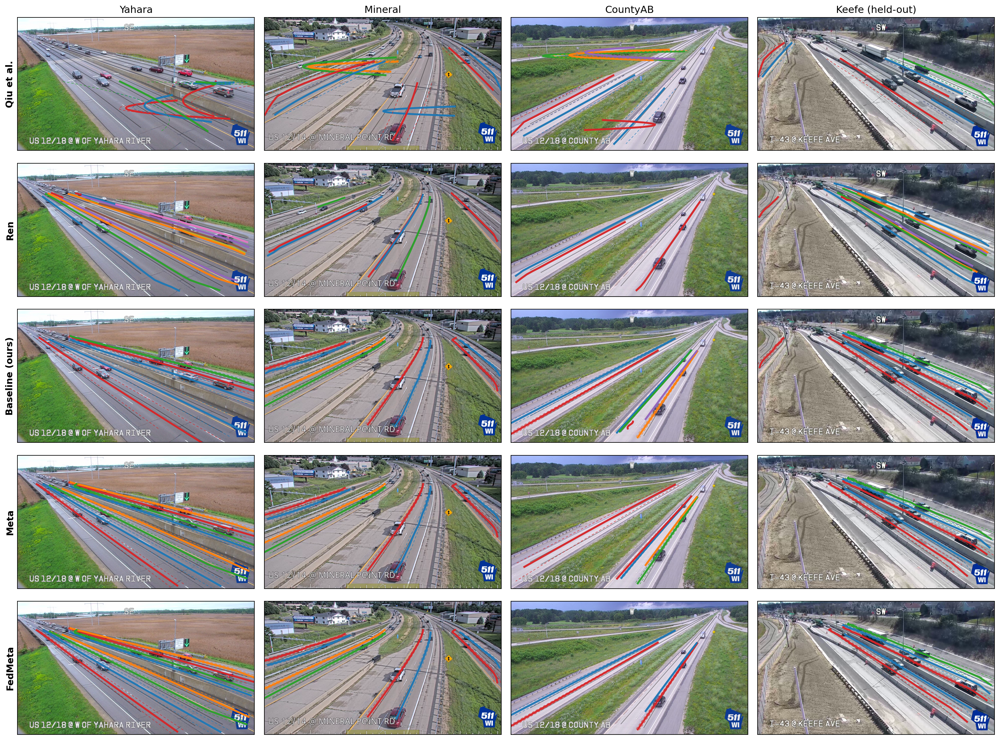
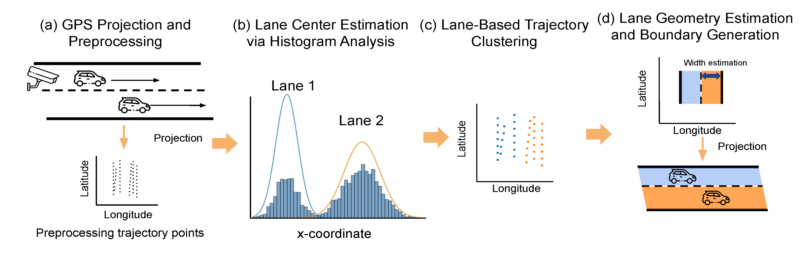
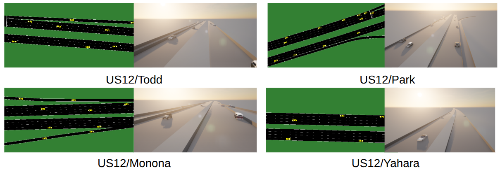

<h1 align="center">Geo-ORBIT: A Federated Digital Twin Framework for Scene-Adaptive Lane Geometry Detection</h1>

<div align="center">
<p>
<a href="https://arxiv.org/abs/2507.08743">Paper<a> | <a href="https://reitamaru.com">Rei Tamaru</a>, <a href="https://scholar.google.com/citations?user=0QzhzL0AAAAJ">Pei Li</a>, and <a href="https://scholar.google.com/citations?user=Kg5OoCUAAAAJ">Bin Ran</a> | University of Wisconsin–Madison</p>
</div>

---

**Geo-ORBIT** (Geometrical Operational Roadway Blueprint with Integrated Twin) is a unified framework that integrates real-time lane detection, federated learning, and digital twin synchronization. It is designed to support active traffic management, infrastructure monitoring, and real-time scenario testing without relying on centralized data collection.

At the core of Geo-ORBIT is **FedMeta-GeoLane**, a federated meta-learning-based lane detection model that adapts to scene-specific geometry using only vehicle trajectory data. By preserving privacy and reducing bandwidth, this system enables scalable deployment across diverse roadside camera environments.

<figure style="text-align: center;">
  
  <figcaption><b>Figure:</b> Qualitative comparison across four sites, with Keefe held out. Rows show the two external baselines (Qiu et al. and Ren), then the fixed baseline, the per-camera meta model, and the federated meta model; columns show Yahara, Mineral, CountyAB, and Keefe. Detected lanes are grouped by lane group and coloured left to right within each group, drawn over the human annotations in faint black.</figcaption>
</figure>
  <!-- <figcaption><b>Figure:</b> Architecture of the federated meta-learning framework. The framework detects roadway geometry at local entities with local GeoLane models. The central server collects parameters from local entities with federated learning. The DT synchronizes road geometry and trajectories in a simulated environment.</figcaption> -->


## System Architecture

Geo-ORBIT is composed of three modular and interconnected processes:

- **Detection Process**  
  Roadside cameras capture traffic video, from which vehicle trajectories are extracted and projected to GPS space.

- **Service Process**  
  The **FedMeta-GeoLane** model infers lane geometries from trajectories using adaptive parameters, refined through meta-learning and weak supervision (e.g., OpenStreetMap).

- **Simulation Process**  
  Detected lanes are synchronized with **SUMO** and **CARLA** to create a high-fidelity, real-time **Digital Twin** that supports traffic flow rendering and scenario replay.

## Installation
Geo-ORBIT works with Python 3.10+ and Pytorch 2.5.1+.

Clone the repository
```bash
git clone https://github.com/raynbowy23/FedMeta-GeoLane.git
cd FedMeta-GeoLane
```

Create the environment and install dependencies with uv (canonical for this repo; the pins live in `pyproject.toml`).
```bash
uv sync
source .venv/bin/activate   # Linux/macOS
```

Set up SUMO
```bash
sudo apt-get install sumo sumo-tools sumo-doc
export SUMO_HOME="/usr/share/sumo"
```

Prepare data directories
```bash
mkdir -p dataset/511video dataset/511calibration
mkdir -p results logs
```

## How to Use
### Quickstart

Run the complete federated learning pipeline:
```bash
bash run.sh
```
This executes the defualt configuration with federated meta-learning on historical data.

### Basic Usage
1. Prepare camera calibration data.
- Place GPS calibration points in `dataset/511calibration`.
- Format: `camera_name.csv` with columns: `pixel_x, pixel_y, latitude, longitude`.

2. Add camera locations
- List camera names in `dataset/camera_location_list.txt`.
- One camera name per line.

3. Map Data Selection
- Extract corresponding OpenStreetMap data using `python osmWebWizard.py` in `./LaneDetection/osm_extraction`. Alternatively, download it online. (e.g. https://www.openstreetmap.org/#map=17/43.034678/-89.426753)
- Change extracted folder name to camera_name. (e.g. US12_Park)
- Extract `osm.net.xml.gz`.
- Run `netconvert -s osm.net.xml --plain-output-prefix osm`, and convert to plainXML `osm.nod.xml` and `osm.edg.xml`.

4. Map Data Preprocess
- Open `osm.net.xml` in local SUMO.
- Trim it to have only target road (Remove unnecessary part).

5. Run Lane Detection
```bash
python main.py --T 60 --is_save --model federated
```

### Advanced Configuration
**Federated Learning**
```bash
python main.py --model federated --T 60 --is_save --skip_continuous_learning --use_historical_data
```

Note: include `--skip_continuous_learning` and `--use_historical_data` if you want to skip video detection part for test, which reduce a lot of time.

**Meta Learning (Training on Single Camera)**
```bash
python main.py --model meta --T 60 --is_save --skip_continuous_learning --use_historical_data
```

**Baseline (Fixed Parameters)**
```bash
python main.py --model baseline --T 60 --is_save --skip_continuous_learning --use_historical_data
```

### Key Parameters
- `--T`: Time interval for data collection (seconds)
- `--model`: Learning approach (federated, meta, baseline)
- `--is_save`: Save intermediate results and visualizations
- `--use_historical_data`: Use pre-processed trajectory data
- `--skip_continuous_learning`: Skip real-time detection
- `--lambda_thres`: Vehicle count threshold for learning cycles

### Output Structure
```bash
results/
├── preprocess/                                 # Canonical per-camera tracking output (checked in)
│   └── <camera>/                               # collect_cars.npy, last_frame.npy, trajectory.csv, ...
└── <model>/                                    # baseline | meta | federated
    ├── <camera>/
    │   ├── figures/                            # Visualizations
    │   ├── pixel/                              # Mid-operation visualization
    │   └── federated_trajectory_clustering.csv # Federated learning only
    └── training_results/                       # Final results
```

## Simulation Integration

Look at [the detailed process](./OpenDriveConversion/README.md) to create digital twin integration.

### SUMO Integration
1. Generate SUMO network
```bash
bash convert_sumo2xodr.sh camera_name
```

2. Run trajectory synchroniztaion
```bash
python OpenDriveConversion/det2sumo_sync.py \
    --camera_loc camera_name \
    --dataset_path ./dataset/
```

### CARLA Integration

1. Start CARLA server
```bash
# In CARLA directory
make launch
# OR
./CarlaUE4.sh
```

2. Load generated map
```bash
python OpenDriveConversion/openDrive2Carla.py \
    --map_file results/camera_name/sumo/camera_name
```

3. Run co-simulation
```bash
python OpenDriveConversion/run_synchronization.py osm.sumocfg --sumo-gui
```

## (Short Summary) FedMeta-GeoLane: Federated Meta-Learning Lane Detection

FedMeta-GeoLane treats each roadside camera deployment as a unique task. A shared meta-learner predicts optimal detection parameters using context features like vehicle speed and trajectory distribution. Key highlights include:

- **Black-box meta-learning**: No need for gradient flow through detection pipeline  
- **Federated optimization**: Local training with privacy-preserving aggregation  
- **Scene adaptation**: Immediate configuration for unseen locations

<figure style="text-align: center;">
  
  <figcaption><b>Figure:</b> Overview of Knowledge-Based Lane Detection Algorithm. (a) Video detection and trajectory projection to GPS coordinates. (b) Lane center estimation using histogram analysis. (c) Lane-based trajectory clustering with KMeans. (d) Lane geometry estimation and boundary generation.</figcaption>
</figure>


_Validated against independent human annotations, FedMeta-GeoLane detects lane geometry within about 3 m, roughly an order of magnitude closer than the public map that supervises it, and transfers a single global model to unseen sites while reducing per-camera communication by more than 99%._


## Performance Summary

### Lane Detection Accuracy

Detection is scored against independent human lane annotations with one-to-one Hungarian matching at a 5 m threshold. Numbers below are means over three training seeds (the fixed baseline is deterministic). See the paper for the full geometry decomposition and calibration tables.

**Table: Lane-level detection against human annotations (precision / recall / F1)**
| **Method** | **Seen P** | **Seen R** | **Seen F1** | **Unseen P** | **Unseen R** | **Unseen F1** |
|---|---|---|---|---|---|---|
| OSM reference | 0.65 | 0.60 | 0.63 | 0.28 | 0.34 | 0.31 |
| Qiu et al. | 0.63 | 0.44 | 0.52 | 0.38 | 0.16 | 0.22 |
| Ren | 0.70 | 0.74 | 0.72 | 0.68 | 0.68 | 0.68 |
| GeoLane (baseline) | 0.83 | 0.60 | 0.698 | 0.81 | 0.55 | 0.656 |
| Meta-GeoLane | 0.89 | 0.67 | **0.760** | 0.90 | 0.49 | 0.636 |
| **FedMeta-GeoLane** | 0.88 | 0.67 | 0.757 | 0.91 | 0.53 | **0.666** |

<figure style="text-align: center;">
  
  <figcaption><b>Figure:</b> Qualitative comparison across four sites, with Keefe held out. Rows show the two external baselines (Qiu et al. and Ren), then the fixed baseline, the per-camera meta model, and the federated meta model; columns show Yahara, Mineral, CountyAB, and Keefe. Detected lanes are grouped by lane group and coloured left to right within each group, drawn over the human annotations in faint black.</figcaption>
</figure>


### Transmission Cost Analysis

**Table: Communication payload per federated round**

| Approach | Per camera | Fleet |
|---|---|---|
| Centralized (raw trajectories) | 0.35–4.3 MB | 12.9 MB |
| FedMeta (parameters only) | **0.9 KB** | **5.4 KB** |
| Reduction | **>99%** | **>99%** |

The federated meta-learner exchanges only the low-dimensional parameter vector (632 B upload, 262 B download per camera per round), so no raw trajectory or image content leaves the camera.


## Digital Twin Integration

Geo-ORBIT connects real-world observations to virtual testbeds using a synchronized SUMO–CARLA pipeline:

- GPS-aligned trajectories enable accurate replay in simulation  
- Supports scene-level validation, vehicle re-routing, and visual analytics  
- (Will be implemented) Extendable to multi-scenario environments with dynamic overlays (e.g., vegetation, accidents, road closures)

<figure style="text-align: center;">
  
  <figcaption><b>Figure:</b> Digital twin synchronization with SUMO and CARLA at multiple locations employing real-time vehicle trajectory.</figcaption>
</figure>


## Citation
If you use this work in your research, please cite:

```bibtex
@article{tamaru2025geo,
  title={Geo-ORBIT: A Federated Digital Twin Framework for Scene-Adaptive Lane Geometry Detection},
  author={Tamaru, Rei and Li, Pei and Ran, Bin},
  journal={arXiv preprint arxiv:2507.08743},
  year={2025}
}
```